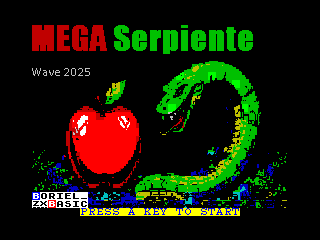
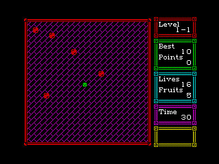
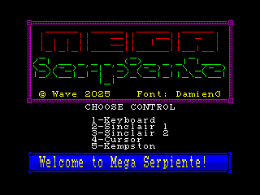
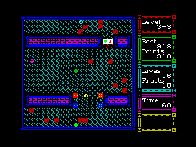
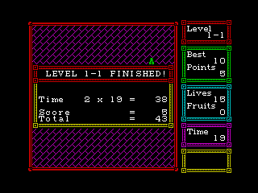

# MEGA SERPIENTE

©2025 Wave

Game written in **Boriel Basic** using **only** the Basic language.

Special thanks to [DamienG](https://damieng.com/typography/zx-origins/) for the amazing fonts (I use the [Koncrete](https://damieng.com/typography/zx-origins/koncrete/) font) and to Andrew C. E. Dent for the [8x8.me](https://github.com/ace-dent/8x8.me) characters.
The title screen and cover are created with the help of AI.

\pagebreak

## The Game

The objective of the game is to eat all the fruits in each level.

After some levels, you will have a bonus level to get more points. You can keep playing as long as there is time left and you don't die.

You can die if you run out of time or if your head collides with a wall or a bug.

And beware, they say that halfway and at the end of the game there is a terrible enemy... if only you could shoot it...

\pagebreak

## Controls

By default they are:
**O**: Left, **P**: Right, **Q**: Up, **A**: Down

**M**: Select/Pause

But they can be redefined or you can choose Sinclair 1, Sinclair 2, Cursor, or Kempston.

You can press Kempston button 1 to start automatically with it.

When pausing the game, you can choose with left and right if you want to continue or exit.

To exit, you must press the Select/Pause button for one second without releasing it.

\pagebreak

## THE ITEMS

* Fruit: Increases the snake's size, gives points, and allows you to finish the level.
* Poisoned fruit: Makes the snake return to its original size.
* ^^: Makes the snake faster if it's not at maximum speed.
* vv: Makes the snake slower if it's not at minimum speed.
* Arrows: Force you to move in that direction.

\pagebreak

## THE OBSTACLES

### THE SCENARIO

You will find different rectangular shapes in each level, don't crash into them!

Also, don't crash into the edges of the level.

### THE BUGS

Bugs will kill you if they collide with your head, but they can bounce off your body without harming you.

#### Horizontal

Moves from left to right when it collides with an obstacle.

#### Vertical

Moves up and down when it collides with an obstacle.

#### Diagonal

Its movement is diagonal; some go one way and some go another.

#### Rotational

This bug chooses a new path each time it encounters an obstacle, but its new direction will depend on its type.

\pagebreak

## Some tips

* If you die by crashing, the time will not reset.
* You will earn more points if you don't die in the level.
* You will earn more points if you complete the level quickly.
* Lasers do not affect your body, perhaps...

