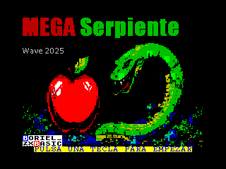
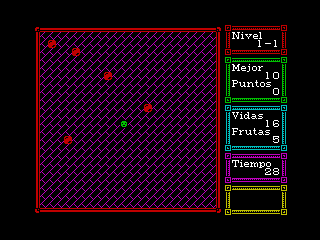
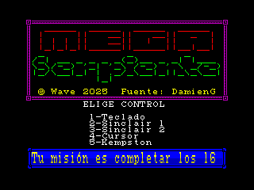
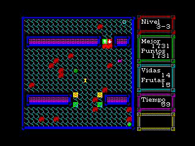
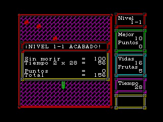

# MEGA SERPIENTE

©2025 Wave

Juego escrito en **Boriel Basic** usando **únicamente** el lenguaje Basic.

Gracias especiales a [DamienG](https://damieng.com/typography/zx-origins/) por las increíbles fuentes (Uso la fuente [Koncrete](https://damieng.com/typography/zx-origins/koncrete/)) y a Andrew C. E. Dent por los caracteres de [8x8.me](https://github.com/ace-dent/8x8.me).
La pantalla de título y la portada están creadas con ayuda de la IA.

\pagebreak

## El juego

El objetivo del juego es comerte todas las frutas de cada uno de los niveles.

Tras algunos niveles tendrás un nivel de bonificación para conseguir más puntos. Puedes seguir jugando mientras quede tiempo y no mueras.

Puedes morir si se te acaba el tiempo o te chocas con la cabeza contra una pared o un bicho.

Y cuidado, dicen que a la mitad y al final del juego hay un enemigo terrible... si pudieras dispararle...

\pagebreak

## Controles

Por defecto son:
**O**: Izquierda, **P**: Derecha, **Q**: Arriba, **A**: Abajo

**M**: Elegir/Pausa

Pero se pueden redefinir o elegir Sinclair 1, Sinclair 2, Cursor o Kempston.

Puedes pulsar el botón 1 del Kempston para empezar automáticamente con él.

Al pausar el juego puedes elegir con izquierda y derecha si quieres seguir o salir.

Para salir debes pulsar el botón de Elegir/Pausa un segundo sin soltarlo.

\pagebreak

## LOS ÍTEMS

* Fruta: Incrementa el tamaño de la serpiente, da puntos y permite terminar el nivel
* Fruta envenenada: Hace que la serpiente vuelva al tamaño original
* ^^: Hace más veloz a la serpiente si no va a velocidad máxima
* vv: Hace más lenta a la serpiente si no va a velocidad mínima
* Flechas: Te obligan a moverte a esa dirección

\pagebreak

## LOS OBSTÁCULOS

### EL ESCENARIO

Encontrarás diferentes formas rectangulares en cada nivel, ¡no choques contra ellas!

Tampoco choques contra los bordes del nivel.

### LOS BICHOS

Los bichos te matarán si chocan contra tu cabeza pero pueden rebotar en tu cuerpo sin que te perjudique.

#### Horizontal

Se mueve de izquierda a derechaal chocarse con un obstáculo.

#### Vertical

Se mueve arriba y abajo al chocarse con un obstáculo.

#### Diagonal

Su movimiento es diagonal, los hay que van hacia un lado y los hay que van hacia otro.

#### Rotativo

Este bicho elige un nuevo camino cada vez que se topa con un obstáculo, pero su nueva dirección dependerá de su tipo.

\pagebreak

## Algunas pistas

* Si mueres por chocarte, el tiempo no se reiniciará
* Ganarás más puntos si no mueres en el nivel
* Ganarás más puntos si completas rápidamente el nivel.
* Los láseres no afectan a tu cuerpo, quizá...

